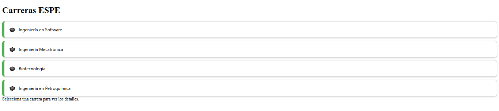
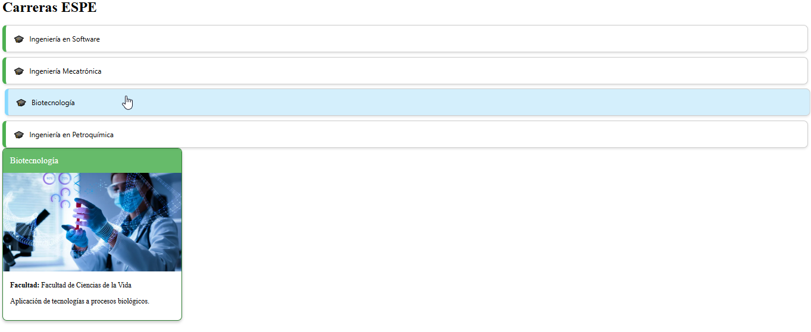
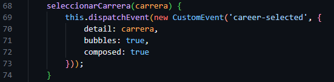
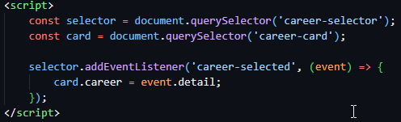

# EXAMEN DE PROGRAMACION INTEGRATIVA PARCIAL 2
- Nombre: Darwin Toapanta.
- Docente: Ing Paulo Galarza.
- Cédula: 2300412323.

# Selector de Carreras con Lit

Este proyecto consiste en una aplicación web construida con **Lit** y **Webpack**, que permite al usuario visualizar diferentes carreras universitarias mediante un **selector** y una **tarjeta informativa**.

## 📁 Estructura del Proyecto

``` bash
examen/
│
├── src/
│ ├── components/
│ │ ├── career-selector.js
│ │ └── career-card.js
│ ├── data/
│ │ └── carreras.json
│ ├── styles/
│ │ └── themes.js
│ └── index.js
├── index.html
├── package.json
├── webpack.config.js
└── README.md
```
## 🛠️ Tecnologías Utilizadas
- Lit
- Webpack
- HTML / CSS / JavaScript

## 🚀 Componentes Creados

### 🔹 `career-selector`

Componente que muestra una lista de carreras disponibles. Al hacer clic en una, se emite un evento personalizado `career-selected`.

- ✅ Datos cargados dinámicamente desde `carreras.json`
- ✅ Mejora de estilos interactivos con hover

### 🔹 `career-card`

Muestra la información detallada de la carrera seleccionada:

- Nombre
- Facultad
- Descripción
- Imagen destacada
- Estilo dinámico aplicado desde `themes.js`

## 📦 Instalación

1. Clona el repositorio:

```bash
Dentro de la crapeta del proyecto en el cmd ejecutamos:

git clone https://github.com/tu-usuario/tu-repositorio.git
```
2. Instala las dependencias:
```bash
npm install
```
3. Inicia el servidor de desarrollo:
```bash
npm run start
```
4. Abre en tu navegador:
```bash
http://localhost:8080/
```

## 🏁 Ejecución 
A continuación, se muestra la interfaz inicial del componente selector de carreras, donde se puede visualizar un listado interactivo de opciones:

<p align="center">  </p

Al seleccionar una carrera, como Ingeniería en Software, se despliega su respectiva tarjeta informativa con estilo personalizado y colores definidos por el tema green del archivo themes.js.

<p align="center">  </p>

Del mismo modo, si el usuario selecciona Ingeniería en Biotecnología, la tarjeta cambia dinámicamente para mostrar la información específica de esa carrera:

<p align="center">  </p>

Esta captura muestra cómo el evento personalizado viaja desde el componente career-selector y cómo se manipula en el archivo principal para actualizar el componente career-card:
<p align="center">  </p>

Aquí se muestra cómo se recibe el evento y se pasa el objeto al componente career-card:

<p align="center">  </p>